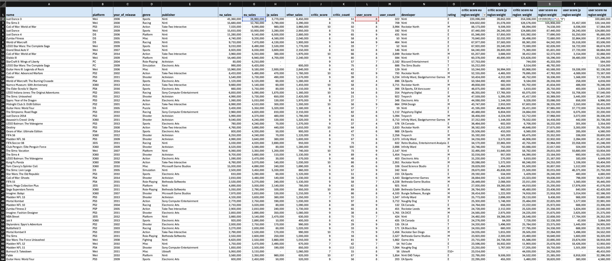
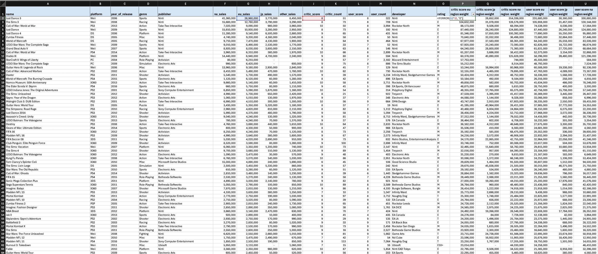

# ER-Games

# 1. ASK Phase (Defining the Problem & Business Goals)

## 1.1: Key Questions to Answer
- How can ER Games align its new puzzle-RPG hybrid game with current industry trends?
- Besides the US, which international markets should ER Games focus on?
- How do changing consumer preferences and demographics influence ER Games' marketing and sales strategy?

## 1.2: Business Context
ER Games is a small company competing against larger RPG game studios. They have released a demo to test consumer interest and identify target demographics. Founder’s View: Market the game outside the US first (especially in Japan & Europe). Consultant’s View: Launch globally without a phased approach.

## 1.3: Stakeholders
- James Spier: ER Games founder

# 2. PREPARE Phase (Collecting & Understanding the Data)

## 2.1 Data Sources:
Console Data (Game Sales & Reviews)

Game information: 
- Name, platform, genre, developer, publisher, release year.
- Sales data: NA, Europe, Japan, and Other regions.
- User & critic reviews: Ratings & number of reviews.
- ESRB ratings: Audience appropriateness.
- Population Data (Market Size & Trends)

Population statistics (1995-2017) for different countries.
- Country Name: name of the country
- Country code: code of the country used in public data
- All other variables from 1995 to 2017: population of country in that year

## 2.2: Data Credibility and ROCCC Assessment

I will use ROCCC to assess whether this data has issues with bias or credibility.

- **Reliable**: Sales data is likely accurate, but critic & user reviews may contain bias or gaps. Population data is reliable if sourced from reputable databases.
- **Original**: The console data comes from a third-party source (likely a gaming database or review aggregator). The population data is from a public dataset (likely a government or UN source). The credibility depends on the reputation of these sources.
- **Comprehensive**: Game data is detailed (genre, platform, sales, reviews), but user demographics are missing. Population data lacks breakdowns like age groups or gaming habits.
- **Current**: No, the data is not current. Population data stops at 2017 (not fully up-to-date). Game data’s relevance depends on its last update—if recent, it’s useful; if outdated, trends may not align with 2025 market dynamics.
- **Cited**: Not explicitly mentioned. We need to verify the sources of the datasets.

# 3: PROCESS PHASE

In the process phase, we ensure our data is clean by correcting or removing inaccurate, corrupted, improperly formatted, duplicate, or incomplete entries within the dataset.

## 3.1: Reviewing Our Data in Excel
We open your worksheet to review headers, data types, and any obvious issues such as extra spaces or misformatted dates. We also adjust column sizes to ensure clear visibility of the data. Additionally, locking the header columns keeps the column labels visible while scrolling horizontally through a large dataset, making it easier to identify which data corresponds to each column (View -> Freeze First Column). Lastly, we want to add commas separating our numbers to read it easier.

#### 3.1.1: Quick Filtering
We want to quickly filter our data to check for any NULL, NA, or 0 values. Use Data → Filter to review unique values and identify any irregularities in each column.

## 3.2: Data Cleaning
#### 3.2.1: Remove Extra Spaces and Standardize Text Case
We want to remove extra spaces using the TRIM function on our text data to eliminate leading, trailing, or extra spaces.

To ensure consistency (e.g., names in proper case), we use the PROPER function in Excel to capitalize the first letter of each word in a text string. It also capitalizes any other letters that follow a non-letter character. 

We conduct these steps for each column involving text so that it prevents lookup errors caused by inconsistent spacing or casing.

#### 3.2:2: Remove Duplicate Rows
We want to eliminate rows that are completely duplicate data in the whole row. In the Remove Duplicates dialog box, make sure the 'My list has headers' checkbox is selected if your dataset includes headers. To ensure that an entire row matches exactly before a duplicate is removed, check all columns so that Excel compares the values in every column of each row. If any columns are left unchecked, Excel will only use the selected columns to determine duplicates, which may result in partial matches rather than complete row duplicates.

## 3.3: Adding Column
We aim to add and calculate new columns to better address our key questions: How can ER Games align its new puzzle-RPG hybrid game with current industry trends? Beyond the US, which international markets should ER Games prioritize? And how do shifting consumer preferences and demographics impact ER Games' marketing and sales strategy?

#### 3.3.1: Critic and User Score Region Weight for Europe, Japan, and North America
By combining sales and reception data, ER Games can gain deeper insights into its game's performance, as sales alone may be driven by hype or brand recognition rather than genuine enjoyment. Critic and user scores provide a crucial layer of quality perception, helping to determine whether players truly appreciate the game or if sales are influenced by other factors. This approach enables ER Games to assess not only revenue but also customer satisfaction across different regions.

We create 6 new columns: critic score eu region weight, critic score jp region weight, critic score na region weight, user score eu region weight, user score jp region weight, and user score na region weight.

For the critic score region weight, we multiply the region's sales for a specific game by the critic score, and vice versa for the user score.

## User Score Region Wight Formula (e.g. =IFERROR(G2*L2, "0"))

## Critic Score Region Wight Formula (e.g. =IFERROR(G2*J2, "0"))

